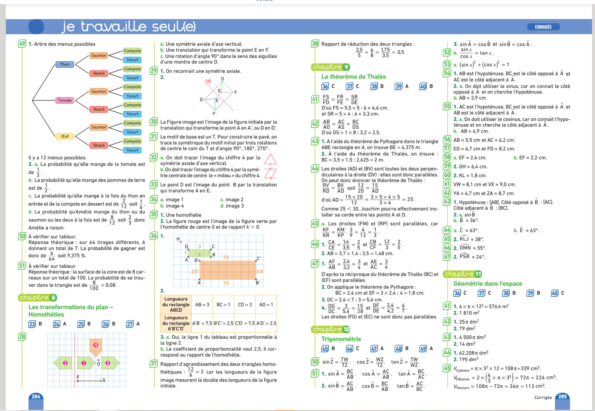

# Pronote resizer

Ce style vous permet de retirer les **watermarks** sur le manuel de maths.

[](https://raw.githubusercontent.com/rafalou38/stylus-styles/master/styles/maths_manual_watermark/style.user.css)

## s'applique a

```md
biblio.editions-bordas.fr
```

## resultat 😎



## Contenu du style 🧐

<details>
<summary>Pour les curieux 😉</summary>

```css
.watermark {
  display: none;
}
```

</details>

## Likez 👍 🌟

Si ce style vous plait cliquez sur **l'etoile** en haut a gauche et **partagez** a vos amis.

<br>
<br>
<br>
<br>

[](https://github.com/rafalou38/stylus-styles/)
