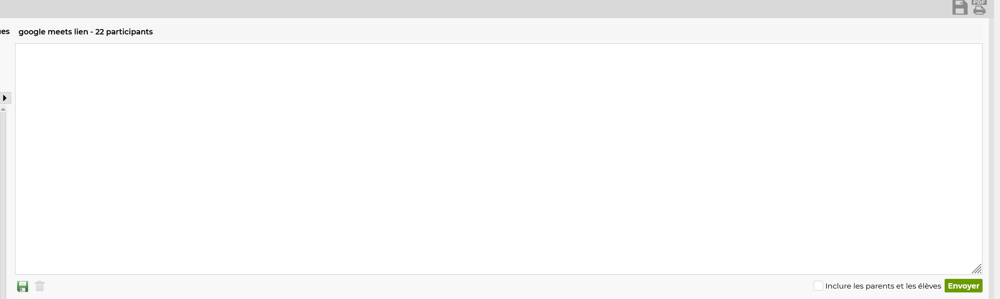

# Pronote resizer

Ce style vous permet de **redimesioner** le minuscule champs de text sur les communications
a la taille que vous voulez.

[](https://raw.githubusercontent.com/rafalou38/stylus-styles/master/styles/pronote/resizer/style.user.css))

## resultat 😎



## Contenu du style 🧐

<details>
<summary>Pour les curieux 😉</summary>

```css
.AlignementHaut.EspaceGauche table.Table td.AlignementHaut textarea {
  resize: vertical;
}
```

</details>

## Likez 👍 🌟

Si ce style vous plait cliquez sur **l'etoile** en haut a gauche et **partagez** a vos amis.

<br>
<br>
<br>
<br>

[](/)
