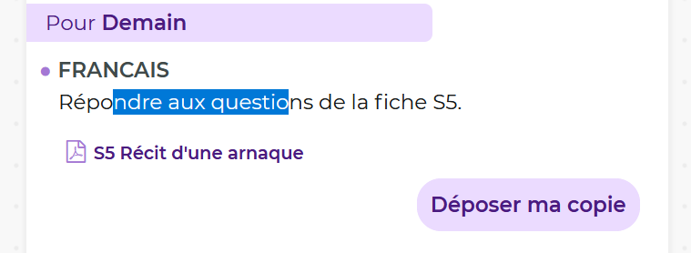

# Pronote selector

Ce style vous permet de **selectioner** le texte sur **pronote**.

[](./pronote_selector.user.css)

## resulta 😎



## Contenu du style 🧐

<details>
<summary>Pour les curieux 😉</summary>

```css
.as-content,
.BlocPastille,
.Fenetre_Scroll {
  user-select: text;
}
```

</details>

## Likez 👍 🌟

Si ce style vous plait cliquez sur **l'etoile** en haut a gauche et **partagez** a vos amis.

<br>
<br>
<br>
<br>

[](/)
